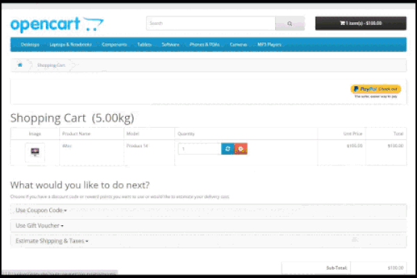

###########################################################
#         PayPal Express Checkout Incontext Experience    #
#         INSTALL INSTRUCTIONS     	                      #
#   							                                        #
#        								                                  #
###########################################################

Prerequisite: ENABLE PAYPAL EXPRESS CHECKOUT MODULE BEFORE ENABLING THIS MODULE.

1. Upload the CONTENTS of the 'upload' folder to your Opencart directory!

2. Login to Opencart, go to Extensions -> Modules -> PayPal Express Checkout Incontext Button- > "Install"

3. This module will use the API credentials that is set in PayPal Express Checkout module.

4. Your Done! 
             
             
             Currently there is an existing issue with the PayPal Express checkout module(that comes by default) only in 2.1.0.1
             https://github.com/opencart/opencart/issues/3626#issuecomment-157746044
             
             To overcome this, you will need to update opencart-2.1.0.1\upload\catalog\controller\payment\pp_express.php
             
             Sadly, there is no vqmod supported for 2.1.0.1
             https://github.com/vqmod/vqmod/wiki/Installing-vQmod-on-OpenCart

Features
i) Buyers would see new in-context lightbox experience rather than re-directing to the paypal classic checkout page.
ii) Buyers gets a feel that they are not leaving your(merchant) website.
iii) This is built on top of existing PayPal Express Checkout core module.The in-context experience is not supported for all the 
countries. The supported countries/other specifications are listed here : https://developer.paypal.com/docs/classic/express-checkout/in-context/
-iv) You will need a version of opencart that already has the Paypal Express extension (1.5.6 or later)

Supported OpenCart Versions: 1.5.6.x, 2.x

